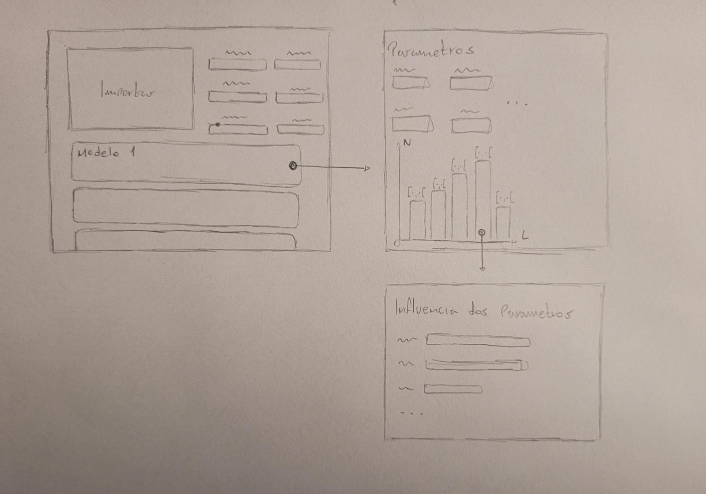

# Análise de Decisão de Crédito — Microinterface p5.js

## 1. Introdução à proposta

O projeto do módulo é um modelo de concessão de crédito utilizando o método Simplex. O usuário da interface não é o cliente que solicita crédito, é o analista do banco, que precisa auditar e compreender as decisões do modelo.

A microinterface foi desenhada para responder à seguinte pergunta: **"O modelo aprovou — mas por quê?"**

A proposta é um infográfico animado e interativo dividido em três painéis navegáveis, cada um respondendo uma camada diferente dessa pergunta:

- `Decisão` → *Panorama geral da resposta*
- `Sensibilidade` → *O que mais pesou nessa decisão?*
- `Perfil` → *Características dos clientes da base*

A navegação é intencional: o analista começa pelo resultado, pode aprofundar nas variáveis e, se quiser mais contexto, compara com casos anteriores.

## 2. Rascunho inicial

## 3. O que foi desenvolvido

### Painel `Decisão`

A escolha de centralizar tudo em cards veio da necessidade de hierarquia visual clara. O card de status (verde/vermelho) comunica o resultado imediatamente. O limite aprovado em tipografia grande (46px) é o número que o analista precisa ver primeiro depois do status. Os quatro cards menores (Risco, Prazo, Taxa, Parcela) complementam sem competir com o limite.

A cor do card de limite segue a cor de risco, verde para aprovado, vermelho para negado, reforçando a leitura sem precisar de texto adicional.

### Painel `Sensibilidade`

A decisão de usar barras horizontais em vez de um gráfico de pizza foi deliberada: barras permitem comparar magnitudes de forma mais direta e deixam espaço para o texto explicativo de cada variável à esquerda.

Cada linha tem dois níveis de leitura: passivo (nome, descrição, percentual) e ativo (clique para expandir os impactos direcionais). Isso evita poluição visual, o analista acessa os detalhes apenas quando quiser.

### Painel `Perfil`

O scatter plot score × renda foi escolhido porque essas são as duas variáveis com maior peso combinado (55%) e as mais intuitivas para o analista. O tamanho do ponto como codificação do limite concedido adiciona uma terceira dimensão sem precisar de um eixo Z.

A zona sombreada de aprovação foi adicionada para dar contexto espacial imediato, o analista entende a lógica de aprovação do modelo antes mesmo de passar o mouse em qualquer ponto.

O tooltip foi projetado para ser completo mas não redundante: mostra score, renda, razão D/R com avaliação inline ("dentro do ideal" / "acima do ideal") e o limite como múltiplo da renda, que é uma métrica mais intuitiva do que o valor absoluto.

### Recursos p5.js utilizados

| Recurso | Uso |
|---|---|
| `arc()` | Bordas arredondadas e arcos animados |
| `rect()` com raio | Cards, barras e painéis |
| `ellipse()` | Pontos do scatter e partículas de fundo |
| `map()` | Mapeamento de valores para posições no scatter |
| `dist()` | Detecção de hover nos pontos do scatter |
| `sin()` | Pulsação das partículas de fundo |
| `constrain()` | Posicionamento seguro dos tooltips |
| `mousePressed()` | Navegação entre abas e expansão de linhas |
| `windowResized()` | Responsividade ao redimensionar |

### Como executar

Com `index.html` e `sketch.js`, abra o `index.html` pelo Live Server.